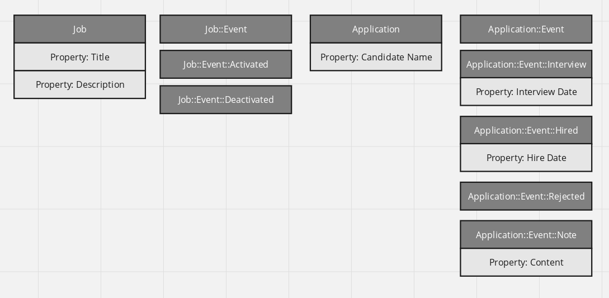

# Backend task: ATS with Event Sourcing

## Background:
You are tasked with designing the first version of a small applicant tracking
system. The company wants to use this system to manage which candidates
applied to one of their positions and what the status of the application is so that
the HR managers have an overview.

### Technical requirements:

Your CTO requires that the system should use Event Sourcing to manage status
of both jobs and applications so that the system can track all data historically.
This means the status must be calculated based on a separate “event” model,
not a property on the model itself. The event tables of each of those models
should use single table inheritance.

A job's status should be calculated on what events were created for it:
- If no event was created a job is 'deactivated'.
- If the last event created for it is `Job::Event::Activated`, it is 'activated'
- and if the last event was `Job::Event::Deactivated` it is 'deactivated'.

Similarly for an application the status can be calculated based on the event:
- If no event is given, the status should be `applied`,
- if the last event was `Application::Event::Interview`, it should be `interview`,
- if it was `Application::Event::Hired`, it should be `hired`
- and if the last event was `Application::Event::Rejected`, it should be
`rejected`.

Furthermore the HR manager can write a note about the applicant which should
be saved in an event as well. This note event does not change the status of the
application.

For events and other models we want to track additional properties as well, see
illustration in the miro board:
https://miro.com/app/board/uXjVMxz6ORc=/?share_link_id=109003450773

## Your Task

Please initialize an API rails application (you do not need to provide a frontend).

1. Create the corresponding models with properties.
2. Provide some seed data for the application to initialize it with some state
for testing.
3. Provide tests for your controllers below and any critical method.

Then provide the following two controllers (as a JSON API):

4. A controller which returns all applications for all activated jobs. Please filter
all applications from deactivated jobs. Properties:
- Name of the job
- Name of the candidate
- Status of the application (see above)
- Number of notes written
- Interview date of the first interview (or null if no interview)

5. A controller which lists all jobs (including deactivated ones). Properties:
- Name of the job
- Status of the job (see above, ‘activated’ or ‘deactivated’)
- Number of hired candidates
- Number of rejected candidates
- Number of ongoing applications (where status is not hired or
rejected)

# My comments

1. The requirement to keep all events in one table is funny. I see much more sense to to separate them into 2 tables, one for Jobs and one for Applications.

1. Since I unless it is explicitly required always use `sqlite3` the use of `json` field for the optional values of `Event`s is not possible. While storing JSON as text makes no sense since it decreases the performance.

1. Use of ElasticSearch for this application is senseless since:
- it does not speed up the response significantly if at all
- it requires more disk memory
- the transfer of the changes in the database to the ElasticSearch replica requires some time therefore there is some period of time after an `Event` occurs till the depending model state change becomes visible. In my previous project with ElasticSearch it took 12 hour in average.

1. The creating `#state` for the subclasses of `Event` is not needed since in most cases we should calculate the state of the depending model without instantiation of the those models.

1. Due to the lack of time the scopes for `Application` and `Job` were implemented not completely correctly at beginning. Now they are fixed. Yes, some of them still raise an error when they receive `:count`. But sending `:count` with `:all` works as expected. This amend also fixed the problem with the doubled joins.

1. The invalidation of `@status` of `Application` and `Job` is not needed since no one instance live long enough for a status change can have an effect. The implementation of the invalidation of `@status` will nave no other effect than slowing down the application.

1. Due to the lack of time the creation of some indices was skipped. They include the index on `#object_id` for `Event`. The creation of index on `#object_type` is not needed and it is **wrong** to create it.
